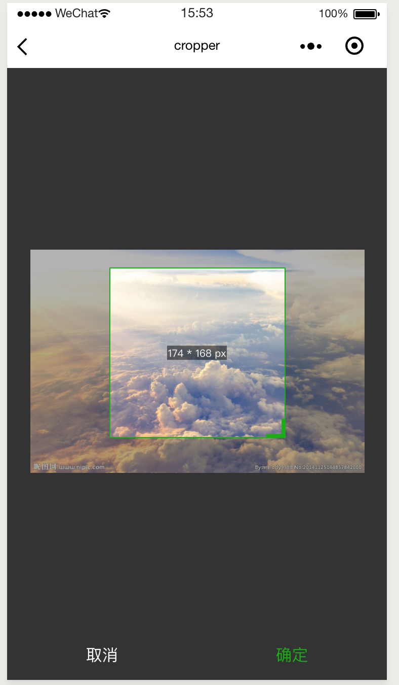

# weapp-cropper
微信小程序图片裁剪
## 它看起来是这样的

### 点击这里效果更佳
https://dgburntemp.oss-cn-qingdao.aliyuncs.com/2019-02-12%20150141.gif

## 它支持一些功能, 它是一个简简单单的工具
> - 支持网络, 项目中和相册选取的图片
> - 可以进行固定比例的裁剪也可以进行自由比例的裁剪
> - 支持各种比例的图片
> - 可以实时显示当前裁剪的大小
## 使用它得需要手动操作了
克隆到本地, 拷贝components文件夹下的cropper文件夹到项目中
> git clone https://github.com/dgburn/weapp-cropper

## 它有下面的一些参数可以设置
参数 | 作用
---|---
width | 需要被裁剪的图片在页面上展示的宽度, 默认330px
imgUrl | 需要裁剪的图片地址(网络地址, 临时地址, 绝对路径)
cutRatio | 裁剪比例, 默认0即自由比例
sizeInfo | 是否显示当前裁剪的大小
croppedMult | 生成图片大小倍数, 默认1
fileType | 生成图片的类型, 默认png
quality | 生成图片质量
